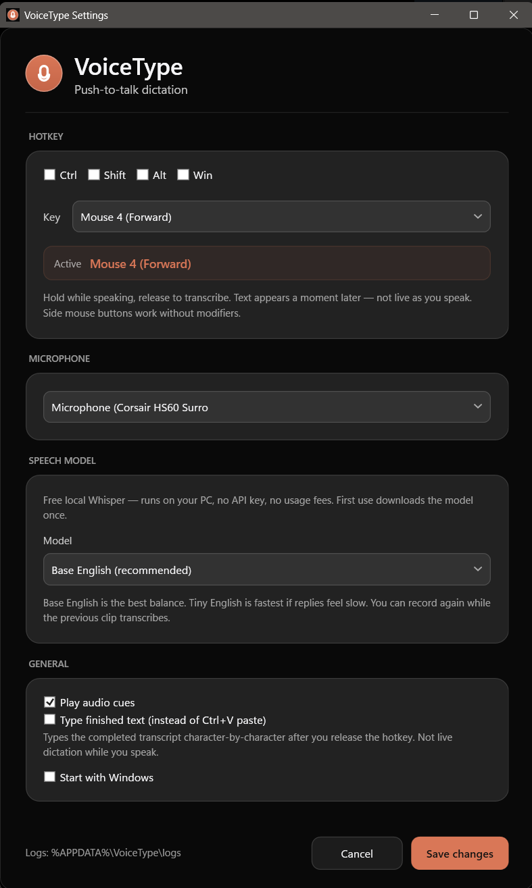

# VoiceType

**Push-to-Talk Speech-to-Text for Windows**

VoiceType is a lightweight Windows desktop application that runs silently in the system tray and enables instant speech-to-text transcription through a configurable global hotkey. Simply hold your hotkey, speak, release, and the transcribed text is automatically pasted into your active application.


---

## ✨ Features

### 🎤 **Push-to-Talk Dictation**
- Hold your configured hotkey to record audio
- Release to automatically transcribe and paste
- Works across all applications (browsers, editors, chat apps, etc.)

### 🔊 **Audio Feedback**
- Subtle audio cues when recording starts/stops
- Error tones for microphone conflicts
- Non-intrusive, configurable beeps

### 🧠 **Dual Speech Engine**
- **Offline Mode** - Fast, private Windows Speech Recognition (no internet required)
- **Cloud Mode** - High-accuracy OpenAI Whisper API transcription

### ⚙️ **Fully Customizable**
- Configure any hotkey combination (Ctrl, Shift, Alt, Win + any key)
- Select your preferred microphone
- Choose between paste (Ctrl+V) or character-by-character typing
- Toggle audio cues on/off
- Start with Windows option

### 🎨 **Modern UI**
- Windows 11 Fluent Design with Mica backdrop
- Automatic dark/light theme matching
- Clean, minimal settings interface

---

## 🚀 Quick Start

### Prerequisites
- **Windows 10** (19041+) or **Windows 11**
- **.NET 8.0 Runtime** ([Download](https://dotnet.microsoft.com/download/dotnet/8.0))
- **Microphone** (any Windows-compatible audio input device)

### Installation

1. **Download** the latest release from the [Releases](../../releases) page
2. **Extract** the ZIP file to a folder of your choice
3. **Run** `VoiceType.exe`
4. The app will start in the system tray (look for the icon near the clock)

### First Use

1. **Right-click** the tray icon → **Settings**
2. Configure your hotkey (default: `Ctrl + Alt + Space`)
3. Select your microphone from the dropdown
4. Choose your speech engine:
   - **Offline** - No setup needed, works immediately
   - **Cloud** - Enter your OpenAI API key for better accuracy
5. Click **Save**

You're ready! Hold your hotkey, speak, release, and watch the magic happen.

---

## 📖 Usage

### Basic Workflow

1. **Position your cursor** in any text field (email, document, chat, etc.)
2. **Hold your hotkey** (e.g., `Ctrl + Alt + Space`)
3. **Speak clearly** into your microphone
4. **Release the hotkey** when done
5. Text appears instantly at your cursor position

### Audio Cues

| Sound | Meaning |
|-------|---------|
| Low tone (800Hz) | Recording started - speak now |
| Higher tone (1200Hz) | Recording stopped - processing |
| Harsh buzz | Error (microphone unavailable or API failure) |

You can disable audio cues in Settings if you prefer silent operation.

---

## ⚙️ Configuration

### Hotkey Setup

**Requirements:**
- Choose at least one modifier (Ctrl, Shift, Alt, or Win)
- Select any letter, number, or function key
- Avoid conflicts with system shortcuts (e.g., Win+L locks Windows)

**Recommended combinations:**
- `Ctrl + Alt + Space` (default)
- `Ctrl + Shift + V`
- `Win + Shift + D`

### Microphone Selection

The app lists all available audio input devices. Select:
- **Default** - Uses your Windows default recording device
- **Specific Device** - Pin to a particular microphone

**Troubleshooting:**
- If your mic isn't listed, check Windows Sound settings
- Ensure the device is enabled and not in use by another app
- Try running VoiceType as Administrator if permission issues arise

### Speech Engine Modes

#### Offline Mode (Windows Speech Recognition)
✅ **Pros:**
- No internet required
- No API costs
- Fast response time
- Completely private

❌ **Cons:**
- Lower accuracy than cloud
- Requires Windows Speech Recognition language pack installed
- Dictionary-based (may miss uncommon words)

**Setup:** No configuration needed. Ensure you have a language pack installed via Windows Settings → Time & Language → Speech.

#### Cloud Mode (OpenAI Whisper)
✅ **Pros:**
- State-of-the-art accuracy
- Supports 99+ languages
- Handles accents, background noise, technical terms

❌ **Cons:**
- Requires internet connection
- API costs (~$0.006 per minute of audio)
- Slightly slower due to upload time

**Setup:**
1. Get an API key from [OpenAI Platform](https://platform.openai.com/api-keys)
2. Enable "Use Cloud" in Settings
3. Paste your key in the API Key field
4. Save

**Cost example:** 1 hour of dictation ≈ $0.36 USD

### Text Delivery Modes

| Mode | How it works | Use when |
|------|-------------|----------|
| **Paste** (default) | Copies text to clipboard, sends Ctrl+V | Most applications (fast, preserves formatting) |
| **Type** | Types each character individually | Apps that block paste (e.g., some games, terminals) |

---

## 🏗️ Architecture

VoiceType is built with modern .NET practices:

```
┌─────────────────┐
│  System Tray    │  WPF NotifyIcon with context menu
└────────┬────────┘
         │
┌────────▼────────┐
│ DI Container    │  Microsoft.Extensions.DependencyInjection
└────────┬────────┘
         │
    ┌────┴─────────────────┬─────────────────┬──────────────┐
    │                      │                 │              │
┌───▼────────┐   ┌─────────▼────────┐   ┌───▼──────┐   ┌──▼───────┐
│  Hotkey    │   │ Audio Capture    │   │  Speech  │   │   Text   │
│  Service   │   │   Service        │   │ Resolver │   │ Injection│
│            │   │  (NAudio)        │   │          │   │ Service  │
│ Win32 Hook │   │  16kHz Mono WAV  │   │ ├Offline │   │          │
└────────────┘   └──────────────────┘   │ └Cloud   │   │InputSim+ │
                                        └──────────┘   └──────────┘
```

### Key Components

- **HotkeyService** - Low-level keyboard hook (WH_KEYBOARD_LL) for system-wide push-to-talk
- **AudioCaptureService** - NAudio WaveInEvent recorder, outputs 16kHz mono 16-bit PCM
- **AudioCueService** - Beep synthesizer using NAudio SignalGenerator
- **OfflineSpeechToTextService** - System.Speech wrapper with dictation grammar
- **CloudSpeechToTextService** - OpenAI Whisper REST client
- **TextInjectionService** - InputSimulatorPlus for keyboard simulation
- **DictationCoordinator** - Orchestrates the full pipeline (hotkey → record → transcribe → inject)

### Design Patterns

- **MVVM** - Settings UI via CommunityToolkit.Mvvm
- **Dependency Injection** - All services are injected
- **Strategy** - SpeechToTextResolver picks engine at runtime
- **Observer** - EventArgs for hotkey press/release

---

## 🛠️ Building from Source

### Requirements
- Visual Studio 2022 (17.8+) or .NET 8 SDK
- Windows 10 SDK (10.0.19041.0)

### Steps

```bash
# Clone the repository
git clone https://github.com/yourusername/VoiceType.git
cd VoiceType

# Restore dependencies
dotnet restore

# Build
dotnet build -c Release

# Run
dotnet run --project src/VoiceType/VoiceType.csproj
```

### Project Structure

```
SpeechToText/
├── src/VoiceType/
│   ├── Models/              # Data models (AppSettings, HotkeyConfig)
│   ├── Services/            # Business logic (DI-registered services)
│   │   ├── HotkeyService.cs
│   │   ├── AudioCaptureService.cs
│   │   ├── OfflineSpeechToTextService.cs
│   │   ├── CloudSpeechToTextService.cs
│   │   ├── DictationCoordinator.cs
│   │   └── ...
│   ├── ViewModels/          # MVVM view models
│   ├── Views/               # WPF XAML windows
│   │   └── SettingsWindow.xaml
│   ├── Utils/               # Helpers (KeyCatalog, etc.)
│   ├── App.xaml             # WPF application entry point
│   └── VoiceType.csproj
├── Prompt.md                # Original specification
├── plan.md                  # Implementation plan
└── README.md                # This file
```

---

## 🐛 Troubleshooting

### "Microphone unavailable" error

**Cause:** Another app is using your microphone  
**Fix:**
1. Close apps that might be using the mic (Discord, Zoom, OBS, etc.)
2. Check Windows Sound settings → Recording tab
3. Run VoiceType as Administrator if permission denied

### "No offline speech recognizer is installed"

**Cause:** Windows Speech Recognition language pack missing  
**Fix:**
1. Open Windows Settings → Time & Language → Speech
2. Click "Add languages" and install your language
3. Restart VoiceType

### Hotkey doesn't work

**Possible causes:**
- Another app registered the same combination (try a different hotkey)
- The app isn't running (check system tray)
- UAC-elevated apps block low-level hooks (run VoiceType as Admin)

### Text doesn't paste

**In Paste mode:**
- Some apps block programmatic paste → Try "Type instead of paste" in Settings

**In Type mode:**
- Ensure the target window has focus when you release the hotkey
- Some fullscreen games block input simulation → Run game in windowed mode

### Cloud mode errors

| Error | Meaning | Fix |
|-------|---------|-----|
| "No API key" | API key not set | Add your OpenAI key in Settings |
| "401 Unauthorized" | Invalid API key | Check your key at platform.openai.com |
| "429 Rate limit" | Too many requests | Wait a minute, or upgrade your OpenAI plan |
| "Network error" | No internet / firewall | Check your connection, disable VPN if needed |

---

## 🔒 Privacy & Security

### Data Collection
**VoiceType collects NO telemetry or analytics.** All data stays on your machine.

### Offline Mode
- Audio never leaves your PC
- Uses Windows built-in speech engine
- Settings stored locally in `%APPDATA%\VoiceType\settings.json`

### Cloud Mode
- Audio files are sent to OpenAI's Whisper API endpoint
- OpenAI's [data usage policy](https://openai.com/policies/api-data-usage-policies) applies
- Audio is NOT used to train models (as of Mar 1, 2023 policy)
- Temporary WAV files are deleted immediately after transcription

### API Key Storage
- Stored in plaintext in `settings.json` (user's AppData folder)
- Only accessible to your Windows user account
- Never transmitted except to OpenAI API over HTTPS

**Recommendation:** Use an API key with spending limits set in your OpenAI dashboard.

---

## 📝 Settings File

Settings are stored in JSON at:
```
%APPDATA%\VoiceType\settings.json
```

Example:
```json
{
  "Hotkey": {
    "Modifiers": 3,
    "VirtualKey": 32,
    "KeyName": "Space"
  },
  "MicrophoneDeviceNumber": -1,
  "MicrophoneName": "Default",
  "Engine": "Offline",
  "CloudApiKey": "",
  "StartWithWindows": false,
  "PlayBeep": true,
  "Delivery": "Paste"
}
```

**Manual editing:** The app reloads settings when opened. Edit while the app is closed for best results.

---

## 🎯 Roadmap

Planned features:
- [ ] Multilingual UI (Spanish, French, German, Chinese)
- [ ] Automatic punctuation insertion (offline mode)
- [ ] Voice commands ("new line", "delete that", etc.)
- [ ] Per-app hotkey profiles
- [ ] Alternative cloud providers (Azure Cognitive, Google Cloud)
- [ ] System-wide spellcheck integration
- [ ] Noise reduction preprocessing
- [ ] Customizable audio cue sounds

---

## 🤝 Contributing

Contributions are welcome! Please follow these guidelines:

1. **Fork** the repository
2. **Create** a feature branch (`git checkout -b feature/amazing-feature`)
3. **Commit** your changes (`git commit -m 'Add some amazing feature'`)
4. **Push** to the branch (`git push origin feature/amazing-feature`)
5. **Open** a Pull Request

### Code Style
- Follow existing patterns (MVVM, DI, etc.)
- Add XML doc comments to public APIs
- Keep services focused (single responsibility)
- Use `async`/`await` for I/O operations

### Testing
Before submitting:
- Build in Release mode without warnings
- Test both Offline and Cloud modes
- Verify Settings window layout at 100%, 125%, 150% DPI

---

## 📄 License

This project is licensed under the **MIT License** - see below for details:

```
MIT License

Copyright (c) 2024 VoiceType Contributors

Permission is hereby granted, free of charge, to any person obtaining a copy
of this software and associated documentation files (the "Software"), to deal
in the Software without restriction, including without limitation the rights
to use, copy, modify, merge, publish, distribute, sublicense, and/or sell
copies of the Software, and to permit persons to whom the Software is
furnished to do so, subject to the following conditions:

The above copyright notice and this permission notice shall be included in all
copies or substantial portions of the Software.

THE SOFTWARE IS PROVIDED "AS IS", WITHOUT WARRANTY OF ANY KIND, EXPRESS OR
IMPLIED, INCLUDING BUT NOT LIMITED TO THE WARRANTIES OF MERCHANTABILITY,
FITNESS FOR A PARTICULAR PURPOSE AND NONINFRINGEMENT. IN NO EVENT SHALL THE
AUTHORS OR COPYRIGHT HOLDERS BE LIABLE FOR ANY CLAIM, DAMAGES OR OTHER
LIABILITY, WHETHER IN AN ACTION OF CONTRACT, TORT OR OTHERWISE, ARISING FROM,
OUT OF OR IN CONNECTION WITH THE SOFTWARE OR THE USE OR OTHER DEALINGS IN THE
SOFTWARE.
```

---

## 🙏 Acknowledgments

Built with these excellent libraries:
- [NAudio](https://github.com/naudio/NAudio) - Audio capture and playback
- [InputSimulatorPlus](https://github.com/TChatzigiannakis/InputSimulatorPlus) - Keyboard simulation
- [CommunityToolkit.Mvvm](https://github.com/CommunityToolkit/dotnet) - MVVM helpers
- [System.Speech](https://learn.microsoft.com/dotnet/api/system.speech) - Offline speech recognition
- [OpenAI Whisper](https://openai.com/research/whisper) - Cloud transcription

---

## 📞 Support

- **Issues:** [GitHub Issues](../../issues)
- **Discussions:** [GitHub Discussions](../../discussions)
- **Email:** support@voicetype.app (if applicable)

---

## ⭐ Star History

If VoiceType saves you time, consider giving it a star! ⭐

---

**Made with ❤️ for the Windows community**

## Screenshots

### clipboard-1781811875354-0

